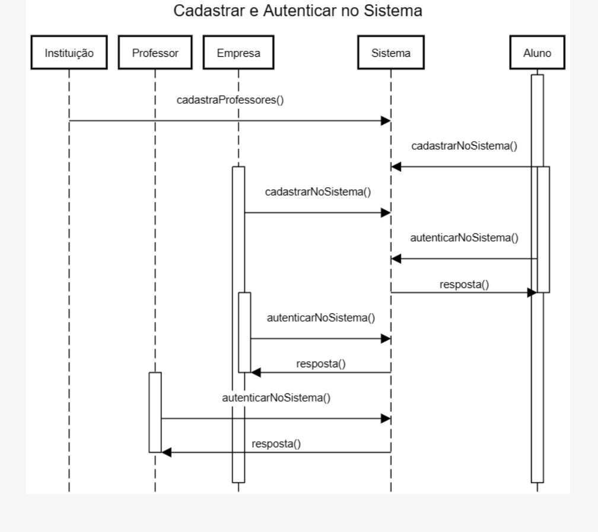
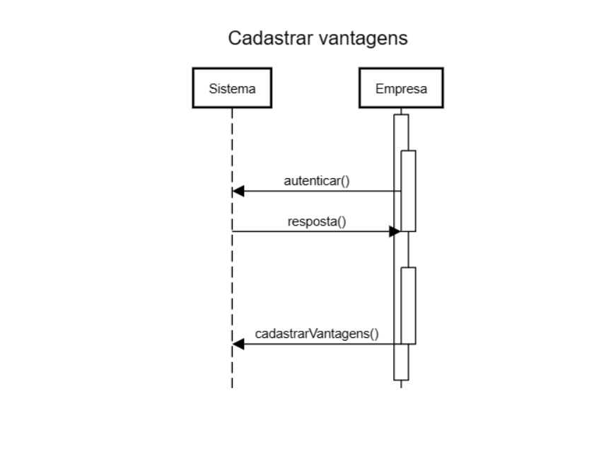
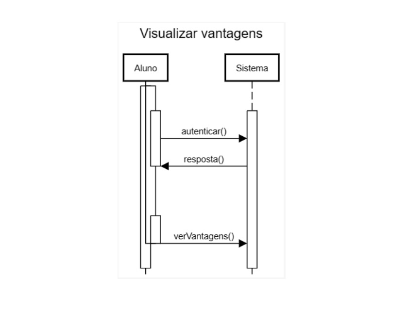
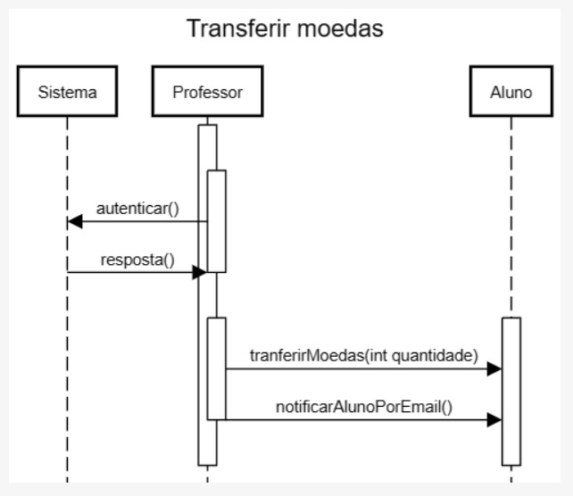
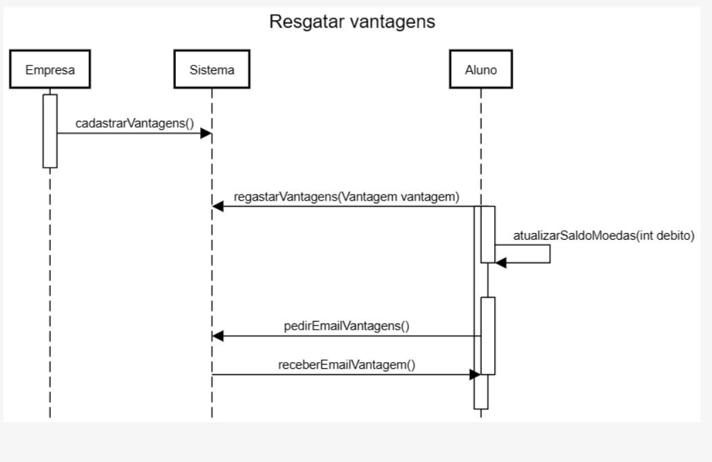

# Sistema de Moeda Estudantil

## Alunos integrantes da equipe

* Eric Rodrigues Diniz
* Luiz Felipe Vieira
* Gustavo Riegert
* Renato Paganini Thurler Filho

## Professores responsáveis

* Danilo Boechat Seufitelli

## Descrição do Sistema:

Os alunos que desejam ingressar no sistema de mérito devem realizar um cadastro, indicando nome, email, CPF, RG, Endereço, Instituição de Ensino e curso. As instituições participantes já estão pré-cadastradas no sistema, para que o aluno selecione.

Os professores já estarão pré-cadastrados no sistema (a instituição envia a lista no momento da parceria). Cada professor terá armazenado o seu nome, CPF e departamento que está vinculado. É necessário deixar explícito que ele faz parte de uma instituição.

A cada semestre, os professores recebe um total de mil moedas, que podem ser distribuídas aos seus alunos como forma de reconhecimento por bom comportamento, participação em aula, etcs. Esse total é acumulável no semestre (isto é, se o professor não distribuir todas as moedas num semestre, o total de 1.000 novas moedas será adicionado ao seu saldo corrente).

Para enviar moedas, o professor deve possuir saldo suficiente, indicando qual aluno deverá receber o montante, bem como o motivo pelo qual ele está sendo reconhecido (uma mensagem aberta, obrigatória).

Ao receber uma moeda, o aluno deve ser notificado por email.

Professores e alunos devem ser capazes de consultar o extrato de sua conta, visualizando o total de moedas que ainda possui, bem como as transações que realizou (para o professor, o envio de moedas; para o aluno, recebimento ou troca de moedas).

Para trocar moedas, o aluno deve selecionar uma das vantagens cadastradas no sistema. Elas incluem, por exemplo: desconto em restaurantes da universidade, desconto de mensalidade, ou compra de materiais específicos.

Empresas que sejam realizar parceria também devem se cadastrar no sistema, incluindo as vantagens que deseja oferecer e o custo de cada uma dela (em moedas).

Para cadastrar uma vantagem, a empresa parceira deve adicionar também uma descrição e foto do produto.

Ao resgatar uma vantagem, o aluno deve ter o valor descontado do seu saldo. Um email de cupom deve ser enviado para que ele utilize na troca presencial. Um email também deve ser enviado ao parceiro, para que ele possa conferir a troca. Ambos os emails devem incluir um código gerado pelo sistema, a fim de facilitar o processo de conferência.

Por fim, alunos, professores e empresas parceiras precisam ter um login e uma senha cadastrados para acessar o sistema. Em todos os casos, um processo de autenticação é necessário para realização dos requisitos.

## Sprint 01:

##  Histórias do Usuário

**Para Alunos:**

1. **Cadastro no Sistema:**
   - *Eu, como aluno,* gostaria de me cadastrar no sistema de mérito, fornecendo informações pessoais como nome, email, CPF, RG, Endereço, Instituição de Ensino e curso, para participar do programa de mérito.

2. **Autenticação no Sistema:**
   - *Eu, como aluno,* gostaria de me autenticar no sistema usando meu e-mail e senha, para acessar os recursos e funcionalidades do programa de mérito.

3. **Recebimento de Notificações por E-mail:**
   - *Eu, como aluno,* gostaria de receber notificações por e-mail sempre que receber moedas no sistema de mérito, para ficar informado sobre minhas transações.

4. **Consulta de Extrato da Conta:**
   - *Eu, como aluno,* gostaria de consultar o extrato da minha conta, incluindo o total de moedas que possuo e as transações que realizei, para acompanhar meu progresso no programa de mérito.

5. **Troca de Moedas por Vantagens:**
   - *Eu, como aluno,* gostaria de poder trocar minhas moedas por vantagens no sistema, para aproveitar os benefícios oferecidos pelo programa de mérito.

**Para Instituições de Ensino:**

1. **Cadastro no Sistema:**
   - *Eu, como instituição de ensino,* gostaria de me cadastrar no sistema de mérito, fornecendo informações sobre a instituição, para participar do programa de mérito.

2. **Cadastro de Professores:**
   - *Eu, como instituição de ensino,* gostaria de cadastrar meus professores no sistema de mérito, para que eles possam distribuir moedas aos alunos.

**Para Professores:**

1. **Recebimento de Moedas por Semestre:**
   - *Eu, como professor,* gostaria de receber moedas por semestre, para distribuir aos meus alunos como parte do programa de mérito.

2. **Autenticação no Sistema:**
   - *Eu, como professor,* gostaria de me autenticar no sistema usando minhas credenciais, para ter acesso às funcionalidades relacionadas ao programa de mérito.

3. **Transferência de Saldo para Alunos:**
   - *Eu, como professor,* gostaria de poder transferir saldo de moedas para meus alunos, incluindo uma justificativa através de mensagens abertas, como reconhecimento por seu desempenho.

**Para Empresas Parceiras:**

1. **Autenticação no Sistema:**
   - *Eu, como empresa parceira,* gostaria de me autenticar no sistema usando minhas credenciais, para acessar os recursos e funcionalidades do programa de mérito.

2. **Cadastro no Sistema:**
   - *Eu, como empresa parceira,* gostaria de me cadastrar no sistema de mérito, fornecendo detalhes sobre a empresa, para participar do programa de mérito.

3. **Cadastro de Vantagens:**
   - *Eu, como empresa parceira,* gostaria de cadastrar vantagens no sistema, para que os alunos possam trocar suas moedas por produtos ou serviços oferecidos pela empresa.

## Diagrama de Casos de Uso

## Diagrama de Classes

## Diagrama de Implantação

## Diagramas de Sequencia

### Cadastar e autenticar

## Cadastrar Vantagem

## Visualizar Vantagens

### Transferir moedas

### Regatar vantagens

